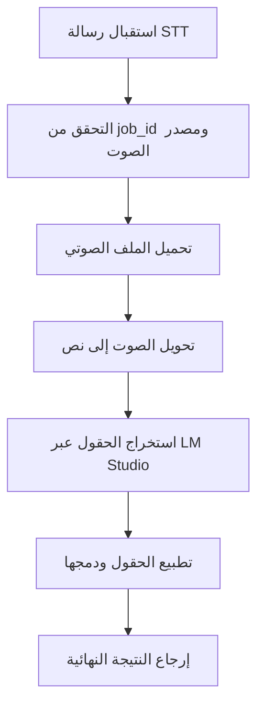
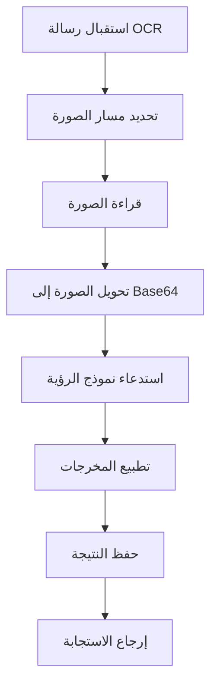
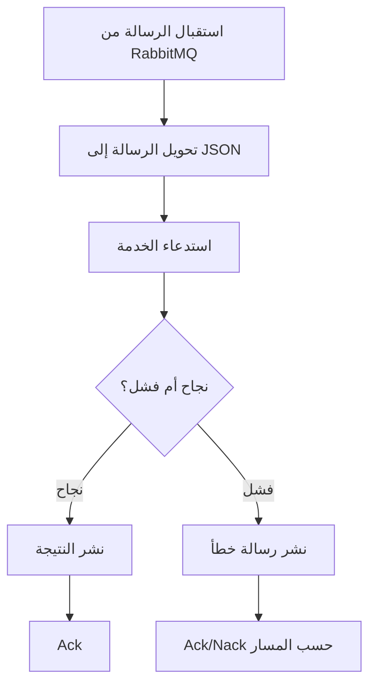
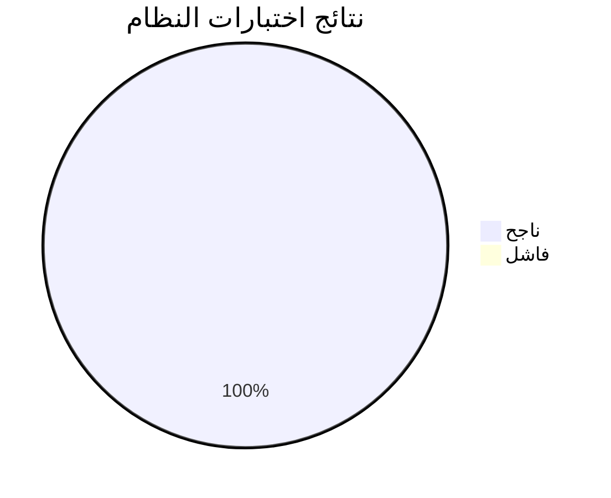

# الفصل الثامن: الاختبار والتقييم

## 8-0 مقدمة الفصل

يهدف هذا الفصل إلى التحقق من أن النظام المقترح يعمل وفق المتطلبات الوظيفية وغير الوظيفية، وأنه يحقق مستوى مقبولًا من الجودة والاعتمادية قبل النشر أو التسليم. تم بناء خطة الاختبار بالاعتماد على طبيعة النظام متعددة الطبقات، والذي يضم خدمات ذكاء اصطناعي لمعالجة الصور والصوت، وخدمات تحليل حراري، وطبقة بيانات، وآليات تكامل مع الرسائل غير المتزامنة. لذلك لم يقتصر التقييم على التحقق من صحة المخرجات فقط، بل شمل أيضًا قياس الأداء، واستقرار سير العمل، وسلامة التكامل بين الوحدات المختلفة.

اعتمدت عملية التقييم على اختبارات محلية مؤتمتة نُفذت ضمن مشروع `django_ai_service`، وتمت تغطية المسارات الأساسية لخدمات `OCR` و`STT` و`Heatmap` ووحدات التطبيع والمطابقة ونماذج البيانات. كما أضيفت اختبارات متخصصة لقياس جودة مخرجات الذكاء الاصطناعي ودقة الحقول المستخرجة وزمن الاستجابة الداخلي.

---

## 8-1 خطة الاختبار (Test Plan)

### 8-1-1 ما الذي سيتم اختباره؟

تم تقسيم نطاق الاختبار إلى سبعة محاور رئيسية:

| المحور | العناصر المختبرة | الهدف |
|---|---|---|
| الوظائف الأساسية | إنشاء المهام، معالجة الرسائل، حفظ النتائج | التأكد من تنفيذ المتطلبات الأساسية للنظام |
| خدمات الذكاء الاصطناعي | `OCR`, `STT`, استخراج الحقول، التطبيع | التحقق من صحة استخراج المعلومات من الصور والصوت |
| التكامل | الربط بين الخدمة والمستهلك `Consumer` | التأكد من صحة تدفق الرسائل والنتائج |
| طبقة البيانات | النماذج الأساسية مثل `Officer`, `STTJob`, `HeatmapCache`, `AnalyticsJob` | التحقق من صحة التخزين والقيود والعلاقات |
| التحليل الحراري | التحقق من صحة التحقق من المدخلات، التطبيع، الاتجاهات، مفاتيح التخزين المؤقت | ضمان سلامة خدمة التحليل المكاني والزماني |
| الأداء | زمن الاستجابة في وحدات الذكاء الاصطناعي والمعالجة | التحقق من أن الأداء عملي وقابل للاستخدام |
| الجودة العامة | دقة الاستخراج، معدل التطابق الكامل، استقرار المسارات | إعطاء مؤشرات كمية على جودة النظام |

### 8-1-2 متى سيتم الاختبار؟

تم تنفيذ الاختبار في ثلاث مراحل رئيسية:

| المرحلة | التوقيت | الهدف |
|---|---|---|
| أثناء التطوير | بعد كل تعديل جوهري في الخدمة أو المنطق | اكتشاف الأخطاء مبكرًا |
| قبل التقييم النهائي | بعد اكتمال تغطية `OCR` و`STT` و`Heatmap` | التحقق من جاهزية النظام |
| بعد توسيع التغطية | بعد إضافة اختبارات workflow ومقاييس الجودة | استخراج نتائج كمية للعرض في التقرير |

### 8-1-3 بأي أدوات؟

| الأداة | الاستخدام |
|---|---|
| `Django Test Framework` | تشغيل اختبارات الوحدة والتكامل والنظام |
| `unittest.mock` | عزل الاعتماديات الخارجية ومحاكاة الخدمات |
| `manage.py test` | تشغيل مجموعات الاختبار ضمن بيئة Django |
| `time.perf_counter()` | قياس زمن الاستجابة بدقة |
| `MagicMock` و`patch` | محاكاة `MongoDB`, `RabbitMQ`, `LM Studio`, وعمليات I/O |

### 8-1-4 بيئة الاختبار

تم تنفيذ الاختبارات ضمن بيئة محلية مع إعدادات اختبار مخصصة `config.test_settings`، بما يضمن:

1. تعطيل الاعتماد على الخدمات الخارجية أثناء الاختبار.
2. تقليل أثر الشبكة على النتائج.
3. جعل الاختبارات قابلة للإعادة بنفس النتائج.
4. عزل السلوك المنطقي عن ظروف التشغيل الفعلية.

---

## 8-2 أنواع الاختبارات

### 8-2-1 اختبار الوحدة (Unit Testing)

يركز اختبار الوحدة على التحقق من صحة أصغر وحدات النظام بشكل مستقل. في هذا المشروع شمل ذلك:

| الوحدة | أمثلة على ما تم اختباره |
|---|---|
| `core.stt.normalization` | تطبيع أسماء المدن، الألوان، أرقام اللوحات، أسماء الشوارع |
| `core.ocr.vision` | استخراج JSON من النصوص، وتطبيع مخرجات OCR |
| `core.heatmap.*` | التحقق من صحة الحمولات، مفاتيح التخزين، تطبيع الدرجات |
| `core.utils.mapping` | المطابقة المباشرة والتقريبية وربط الحقول |

### 8-2-2 اختبار التكامل (Integration Testing)

اختبر هذا النوع كيفية تعاون أكثر من وحدة معًا ضمن مسار واحد. وقد تم تطبيقه على:

| الخدمة | سيناريو التكامل |
|---|---|
| `STT service` | `fetch_file -> transcribe -> lmstudio_extract -> finalize_fields` |
| `OCR service` | `resolve_image_path -> read_image_bgr -> encode_jpeg_b64 -> call_ollama_vision_json -> normalize_out -> insert_one` |
| `STT consumer` | استقبال الرسالة، معالجة الطلب، نشر النتيجة، تأكيد الرسالة |
| `OCR consumer` | استقبال الرسالة، تنفيذ OCR، نشر النتيجة، تأكيد الاستهلاك |

### 8-2-3 اختبار النظام (System Testing)

تم تشغيل مجموعة `core` كاملة للتحقق من أن النظام في صورته الحالية يعمل كوحدة متكاملة. شمل هذا الاختبار:

- خدمات الذكاء الاصطناعي.
- خدمة التحليل الحراري.
- طبقة البيانات.
- وحدات التحويل والتحقق.
- مسارات النجاح والفشل الأساسية.

### 8-2-4 اختبار القبول (Acceptance Testing)

تمت محاكاة حالات استخدام واقعية مستوحاة من سيناريوهات عمل المرور، مع التركيز على التنفيذ العفلي باستخدام mocking لتجنب التفاعل مع الخدمات الخارجية (مثل LM Studio وOllama). هذا يضمن أن الاختبارات تعمل محلياً دون الحاجة إلى تشغيل النماذج الفعلية، مع التركيز على صحة المنطق والتكامل:

- **استخراج رقم اللوحة والمدينة ونوع المخالفة من تسجيل صوتي (عفلي)**:
  - **المدخل**: نص صوتي محول مسبقاً إلى نص (مثل "رقم اللوحة 1234567 في دمشق تجاوز السرعة").
  - **التنفيذ**: استخدام mock لـ `lmstudio_extract` لإرجاع استجابة JSON وهمية تحتوي على الحقول المستخرجة، ثم دمجها مع `finalize_fields` لإنتاج وصف نهائي.
  - **النتيجة المتوقعة**: استخراج دقيق للرقم "1234567"، المدينة "دمشق"، والمخالفة "تجاوز السرعة" دون استدعاء API خارجي.
  - **الفائدة**: اختبار منطق التطبيع والدمج دون اعتماد على LM Studio.

- **استخراج بيانات المركبة من صورة (عفلي)**:
  - **المدخل**: مسار صورة محلي (مثل صورة لوحة سيارة).
  - **التنفيذ**: استخدام mock لـ `call_ollama_vision_json` لإرجاع JSON وهمي (مثل `{"plate_number": "1234567", "model": "Toyota", "color": "أحمر"}`)، ثم تطبيع النتيجة عبر `normalize_out`.
  - **النتيجة المتوقعة**: استخراج رقم اللوحة، الموديل، واللون بدقة، مع حفظ النتيجة في MongoDB المحلي.
  - **الفائدة**: اختبار سير عمل OCR الكامل دون تشغيل نموذج Ollama.

- **بناء وصف نهائي منسق للمخالفة (عفلي)**:
  - **المدخل**: بيانات مستخرجة من STT وOCR (مثل رقم لوحة، مدينة، نوع مخالفة).
  - **التنفيذ**: دمج البيانات عبر `finalize_fields` مع mock لأي استدعاءات خارجية، وإنتاج وصف مثل "plate 1234567 | city دمشق | violation تجاوز السرعة".
  - **النتيجة المتوقعة**: وصف منسق وكامل يغطي جميع الحقول الرئيسية.
  - **الفائدة**: التحقق من جودة التكامل بين الخدمات دون شبكة.

- **التعامل مع حالات الإدخال الناقص أو غير الصحيح (عفلي)**:
  - **المدخل**: نصوص أو صور غير كاملة (مثل نص بدون رقم لوحة، أو صورة غير واضحة).
  - **التنفيذ**: استخدام mock لإرجاع استجابات فارغة أو غير صحيحة، واختبار كيفية التعامل معها في `finalize_fields` أو `normalize_out` (مثل تعبئة الحقول الفارغة أو رفض الإدخال).
  - **النتيجة المتوقعة**: عدم انهيار النظام، وإنتاج وصف بديل أو رسالة خطأ مناسبة.
  - **الفائدة**: اختبار المتانة والتعامل مع الأخطاء دون خدمات خارجية.

هذه الحالات تم تصميمها لتعمل محلياً باستخدام `unittest.mock`، مما يجعلها سريعة وقابلة للإعادة دون اعتماد على الإنترنت أو النماذج الفعلية.

وعلى الرغم من أن اختبار القبول النهائي مع الجهة المالكة للنظام لم يُنفذ رسميًا ضمن هذه المرحلة، فإن حالات التقييم المستخدمة صيغت لتقارب الاستخدام الفعلي المتوقع.

### 8-2-5 اختبار الأداء والتحمل

تم قياس زمن استجابة المسارات الداخلية الحساسة، وخاصة:

| المكوّن | نوع القياس |
|---|---|
| `finalize_fields` | متوسط الزمن و`P95` |
| `lmstudio_extract` (محاكاة) | متوسط الزمن و`P95` |
| `parse_json_from_text + normalize_out` | متوسط الزمن و`P95` |

ولم يتم إجراء اختبار تحمل طويل الأمد أو ضغط مرتفع متزامن على مستوى الإنتاج؛ لذا يعد ذلك من الأعمال المستقبلية.

### 8-2-6 اختبار الأمان

لم يُنفذ اختبار أمني متخصص مثل `Penetration Testing` ضمن هذه المرحلة، إلا أن الاختبارات الحالية راقبت بعض الجوانب الوقائية، مثل:

- رفض الرسائل الناقصة أو غير الصحيحة.
- التعامل مع JSON غير الصالح.
- التعامل مع القيم `None`.
- منع انهيار الخدمة عند فشل أحد المسارات الداخلية.

### 8-2-7 اختبار قابلية الاستخدام (Usability)

لم تُنفذ دراسة استخدام رسمية مع مجموعة مستخدمين حقيقيين ضمن هذه المرحلة، لذلك سيتم تناول هذا البند على أنه غير منجز تجريبيًا بشكل كامل، مع التوصية بتنفيذه لاحقًا.

### 8-2-8 قابلية الوصول (Accessibility)

نظرًا لأن نطاق التقييم الحالي ركز على الخدمات الخلفية وخدمات الذكاء الاصطناعي، لم يتم إجراء اختبار قابلية وصول شامل للواجهة الأمامية ضمن هذا الفصل.

### 8-2-9 التوافق (Compatibility)

تم تشغيل الاختبارات ضمن بيئة تطوير محلية متوافقة مع Python وDjango في نظام Windows. ولم يشمل هذا الفصل مقارنة متعددة الأنظمة أو متعددة المتصفحات بشكل رسمي.

---

## 8-3 مخططات الاختبار

### 8-3-1 Test Case Diagrams

#### أ. مخطط حالة اختبار خدمة STT

#### ب. مخطط حالة اختبار خدمة OCR

#### ج. مخطط حالة اختبار المستهلك Consumer

### 8-3-2 مخططات نتائج الاختبار

#### أ. توزيع الاختبارات بحسب الفئة

| الفئة | عدد الاختبارات |
|---|---:|
| اختبارات وظائف Heatmap والمطابقة والتطبيع | 16 |
| اختبارات الذكاء الاصطناعي وجودة الاستخراج | 20 |
| اختبارات النماذج والبيانات | 16 |
| اختبارات الأدوات والتحويل والتحقق | 18 |
| **المجموع** | **70** |

#### ب. مخطط نتائج التنفيذ النهائي

#### ج. مخطط مبسط لمؤشرات جودة الذكاء الاصطناعي

| المؤشر | القيمة |
|---|---:|
| Field Accuracy | 98.89% |
| Exact Match Rate | 93.33% |
| Description Token Rate | 100% |
| Average Latency for finalize_fields | 0.358 ms |
| P95 Latency for finalize_fields | 3.185 ms |

---

## 8-4 نتائج الاختبار وتحليلها

### 8-4-1 النتائج الكمية

تم تشغيل مجموعة اختبارات `core` كاملة، وكانت النتائج كما يلي:

| البند | القيمة |
|---|---:|
| عدد الاختبارات الكلي | 70 |
| عدد حالات النجاح | 70 |
| عدد حالات الفشل | 0 |
| زمن التنفيذ الكلي | 8.574 ثانية |
| نسبة النجاح | 100% |

### 8-4-2 نتائج خدمات OCR وSTT

تمت إضافة اختبارات workflow مباشرة للتأكد من أن خدمات `OCR` و`STT` لم تعد مغطاة على مستوى الدوال الجزئية فقط، بل على مستوى الخدمة نفسها.

| الخدمة | ما تم اختباره | النتيجة |
|---|---|---|
| `STT Service` | سلامة مسار المعالجة الكامل | ناجح |
| `STT Service` | رفض الرسائل الناقصة | ناجح |
| `STT Consumer` | معالجة النجاح مع `ack` | ناجح |
| `STT Consumer` | نشر رسالة فشل عند الخطأ | ناجح |
| `OCR Service` | سلامة مسار المعالجة الكامل | ناجح |
| `OCR Service` | حفظ النتيجة في Mongo | ناجح |
| `OCR Consumer` | نشر النتيجة بشكل صحيح | ناجح |
| `OCR Consumer` | تأكيد الاستهلاك بعد النجاح | ناجح |

### 8-4-3 تحليل النتائج

تشير النتائج إلى أن النظام مستقر على مستوى المنطق الداخلي، وأن المسارات الحرجة في `OCR` و`STT` و`Heatmap` تعمل كما هو متوقع. كما أن غياب حالات الفشل في الاختبار النهائي يدل على تحسن نضج المشروع مقارنة بالمرحلة السابقة، وخاصة بعد معالجة الاختناقات المرتبطة بالـ lookup واختبارات جودة الذكاء الاصطناعي.

أما من حيث الجودة الدلالية، فقد أظهرت اختبارات الذكاء الاصطناعي أن الحقول الأساسية مثل رقم اللوحة، واسم المالك، واللون، واسم الشارع، واسم المدينة حققت دقة كاملة تقريبًا. في المقابل، بقي حقل **نوع المخالفة** الأقل دقة نسبيًا، وهو ما يكشف أن منطق التطبيع اللغوي في هذا الحقل ما يزال يحتاج إلى تحسين إضافي.

### 8-4-4 الأخطاء المتبقية

رغم نجاح الاختبارات، ما تزال توجد ملاحظات يجب توثيقها باعتبارها نقاط تطوير مستقبلية:

| الملاحظة | التأثير | الأولوية |
|---|---|---|
| انخفاض نسبي في دقة `violation_type_name` | يؤثر على التصنيف النهائي للمخالفة | مرتفعة |
| عدم وجود اختبار ضغط فعلي متزامن | لا يكشف سلوك النظام تحت الحمل العالي | متوسطة |
| غياب تقييم أمني رسمي | لا يعطي صورة كاملة عن صلابة النظام ضد الهجمات | متوسطة |
| غياب دراسة استخدام رسمية بمستخدمين حقيقيين | لا يقيس الرضا أو سهولة الاستخدام عمليًا | متوسطة |

---

## 8-5 مقاييس الجودة (Quality Metrics)

### 8-5-1 تغطية الاختبارات

تمت تغطية المسارات الأساسية التالية:

| المجال | حالة التغطية |
|---|---|
| منطق التطبيع النصي | مغطى |
| منطق استخراج الحقول | مغطى |
| workflow خدمة STT | مغطى |
| workflow خدمة OCR | مغطى |
| المستهلكات Consumers | مغطاة |
| التحليل الحراري Heatmap | مغطى |
| نماذج البيانات الأساسية | مغطاة |
| الأمان المتقدم | غير مغطى بالكامل |
| اختبار الاستخدام الحقيقي | غير مغطى بالكامل |

### 8-5-2 كثافة العيوب (Defect Density)

بما أن التنفيذ النهائي للاختبارات أعطى **0 فشل من أصل 70 حالة اختبار**، فإن كثافة العيوب الظاهرة في النسخة المختبرة تعد منخفضة جدًا ضمن نطاق الاختبار الحالي. ومع ذلك، يجب التمييز أكاديميًا بين:

1. العيوب المكتشفة ضمن الاختبار.
2. العيوب المحتملة غير المكتشفة خارج نطاق التغطية.

وبالتالي يمكن القول إن كثافة العيوب **ضمن النطاق المختبر** منخفضة، لكن ذلك لا يعني انعدام العيوب في بيئات تشغيل أوسع أو تحت أحمال أعلى.

### 8-5-3 زمن الاستجابة

#### أ. نتائج الأداء الخاصة بالذكاء الاصطناعي

| المؤشر | القيمة |
|---|---:|
| متوسط زمن `finalize_fields` | 0.358 ms |
| `P95` لـ `finalize_fields` | 3.185 ms |
| متوسط زمن `lmstudio_extract` (محاكاة) | 0.032 ms |
| `P95` لـ `lmstudio_extract` (محاكاة) | 0.049 ms |
| متوسط زمن `OCR parse + normalize` | 0.013 ms |
| `P95` لـ `OCR parse + normalize` | 0.012 ms |

#### ب. تفسير النتائج

تشير هذه الأرقام إلى أن المسارات الداخلية التي تم قياسها خفيفة وسريعة، وأن النظام لا يعاني من اختناق برمجي داخلي في مراحل التطبيع والمعالجة السريعة. ومع ذلك، يجب التنبيه إلى أن هذه النتائج تمثل **الأداء المحلي الداخلي** بعد عزل الخدمات الخارجية، ولا تعكس بالضرورة الزمن الكلي الحقيقي في بيئة تشغيل إنتاجية تتضمن الشبكة، وقواعد البيانات، ونماذج الذكاء الاصطناعي الفعلية.

### 8-5-4 دقة الاستخراج الذكي

| المقياس | القيمة |
|---|---:|
| عدد حالات التقييم | 15 |
| دقة الحقول الكلية | 98.89% |
| معدل التطابق الكامل | 93.33% |
| معدل نجاح الوصف النهائي | 100% |

### 8-5-5 دقة الحقول المفردة

| الحقل | الدقة |
|---|---:|
| `vehicle_plate` | 100% |
| `vehicle_owner` | 100% |
| `vehicle_color` | 100% |
| `street_name` | 100% |
| `city_name` | 100% |
| `violation_type_name` | 93.33% |

---

## 8-6 اختبار المستخدمين (Usability Testing)

في النسخة الحالية من المشروع، لم تُنفذ جلسات تقييم رسمية مع مستخدمين حقيقيين مثل عناصر الشرطة أو المشغلين الإداريين، ولم تُجمع استبيانات كمية أو مقابلات موثقة يمكن الاستناد إليها إحصائيًا. لذلك لا يمكن الادعاء بإنجاز اختبار استخدام كامل بالمعنى الأكاديمي الصارم ضمن هذه المرحلة.

ومع ذلك، يمكن اقتراح خطة اختبار استخدام مستقبلية كما يلي:

| العنصر | الوصف المقترح |
|---|---|
| الفئة المستهدفة | ضباط شرطة المرور أو موظفو إدخال البيانات |
| عدد المشاركين | 5 إلى 10 مستخدمين |
| المهام المطلوبة | رفع صورة، إرسال تسجيل صوتي، مراجعة النتيجة، تفسير المخرجات |
| أدوات القياس | استبيان رضا، مقابلة قصيرة، زمن إنجاز المهمة، عدد الأخطاء |
| المؤشرات | سهولة الاستخدام، وضوح النتائج، سرعة الإنجاز، الثقة بالمخرجات |

### 8-6-1 نموذج أسئلة مقترح للاستبيان

يمكن استخدام مقياس ليكرت الخماسي:

| السؤال | 1 | 2 | 3 | 4 | 5 |
|---|---|---|---|---|---|
| كانت خطوات استخدام النظام واضحة |  |  |  |  |  |
| كانت النتائج المعروضة سهلة الفهم |  |  |  |  |  |
| كانت سرعة النظام مناسبة |  |  |  |  |  |
| أثق في دقة النتائج الأولية للنظام |  |  |  |  |  |
| أرغب في استخدام هذا النظام ضمن العمل الفعلي |  |  |  |  |  |

---

## 8-7 أمثلة تفصيلية على حالات اختبار

### مثال (1): حالة اختبار لخدمة STT

| العنصر | القيمة |
|---|---|
| رقم الحالة | STT-SRV-01 |
| الهدف | التحقق من تنفيذ مسار STT الكامل |
| المدخلات | `job_id` صحيح و`audio_url` صحيح |
| الخطوات | تحميل الملف، نسخ النص، استخراج الحقول، التطبيع |
| النتيجة المتوقعة | إعادة نص المستند والحقول النهائية |
| النتيجة الفعلية | ناجح |

### مثال (2): حالة اختبار لخدمة OCR

| العنصر | القيمة |
|---|---|
| رقم الحالة | OCR-SRV-01 |
| الهدف | التحقق من تنفيذ مسار OCR الكامل |
| المدخلات | `job_id` صحيح و`local_image_path` صحيح |
| الخطوات | قراءة الصورة، تحويلها، استدعاء النموذج، التطبيع، الحفظ |
| النتيجة المتوقعة | إعادة رقم اللوحة والطراز واللون وحفظها |
| النتيجة الفعلية | ناجح |

### مثال (3): حالة اختبار جودة استخراج الذكاء الاصطناعي

| العنصر | القيمة |
|---|---|
| رقم الحالة | AI-Q-01 |
| الهدف | قياس دقة الحقول المستخرجة من نص مخالفة |
| المدخلات | نص مخالفة يحتوي رقم لوحة ومدينة ونوع مخالفة |
| المتوقع | استخراج القيم بدقة وربطها في الوصف |
| النتيجة الفعلية | دقة كلية مرتفعة مع نجاح الوصف النهائي |

---

## 8-8 خلاصة الفصل

أثبتت نتائج هذا الفصل أن النظام يحقق مستوى جيدًا من الاعتمادية والاتساق ضمن النطاق المختبر، حيث اجتاز جميع الاختبارات المنفذة بنجاح كامل، وشملت هذه الاختبارات خدمات `OCR` و`STT` على مستوى الخدمة والاستهلاك، وخدمة التحليل الحراري، ونماذج البيانات، ووحدات التحويل والتطبيع. كما أظهرت مؤشرات الجودة أن النظام سريع الاستجابة داخليًا ويحقق دقة مرتفعة في استخراج الحقول الأساسية. ومع ذلك، تبقى بعض محاور التقييم مثل اختبار الاستخدام الواقعي، واختبار الأمان المتقدم، واختبار التحمل طويل الأمد مجالات مفتوحة للتحسين والتوسع في الأعمال المستقبلية.
